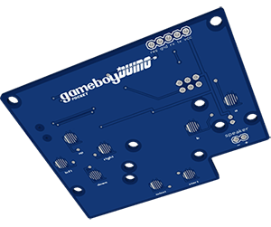
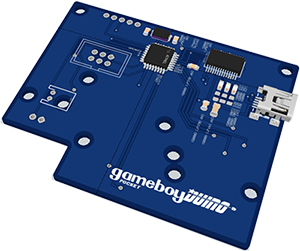

gameboyDuino - Pocket
==================

-------------

# Introduction

**gameboyDuino** is a programmable touch interface that fits the inside dimensions of the **Offical Gameboy Pocket**. 

The hardware is based on AVR microcontrollers and programmed via [AVR Studio](http://www.atmel.ca/microsite/atmel_studio6/) or the [Arduino IDE](http://arduino.cc/en/Main/Software)

**gameboyDuino.** in it's entirety is open source. Including hardware design, software implementation and libraries
***

##Hardware

#### Eagle CAD
All of the PCB design, schema and board layout files where designed in [CadSoft's Eagle Cad PCB](http://www.cadsoftusa.com/eagle-pcb-design-software/product-overview/?language=en) software.

The .sch and .brd files are available in the [master](https://github.com/32teeth/GameBoyDuinoPocket) folder.

|  front | back  |
|---|---|
|   |   |
| capacitive touch d-pad  | atmega328p  |
| capacitive b and a buttons  |  ftdi com port |
| capacitive start select  |  usb interface |
| additional speaker connection  | interface leds  |
| tft break out | icsp programmable port  |
| accurate drill/screw holes | li-po battery connection  |

***
# Thanks
Should you run into any trouble, or have further questions, feel free to reach out.

* [ 32teeth](https://www.facebook.com/32teeth)
* [ eugeneyevhen](https://twitter.com/eugeneyevhen)
* [ SparkyJr](32teeth.github.io/SparkyJr)
* [ 32teeth](http://ca.linkedin.com/in/32teeth)

***

